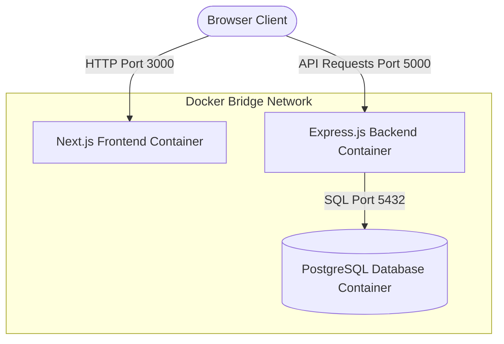

# Phase 1: Environment & Database Bedrock - Research

**Researched:** 2026-06-21
**Domain:** Next.js, Express.js, Sequelize ORM, PostgreSQL, Docker Compose
**Confidence:** HIGH

<user_constraints>
## User Constraints (from CONTEXT.md)

### Locked Decisions
- **D-01:** Use **npm** as the package manager for both `frontend/` and `backend/`.
- **D-02:** Expose PostgreSQL port **5432** directly to the host machine to allow external database clients and migrations to connect.
- **D-03:** Enable full strict TypeScript compiler checks (`strict: true`) in both `frontend/` and `backend/` tsconfig.json configurations.
- **D-04:** Use a monorepo directory layout with `frontend/` (Next.js), `backend/` (Express.js), and root `docker-compose.yml`.

### the agent's Discretion
- Configurations for Dockerfiles, package scripts, and internal folder structure layouts within `frontend/` and `backend/` are at the agent's discretion, provided standard conventions are met.

### Deferred Ideas (OUT OF SCOPE)
- User authentication (Login/Register) – The dashboard is public-facing and read-only for all users.
- CRUD forms for data entry – The system assumes raw data is synced from an external Transaction Processing System (TPS).
</user_constraints>

<architectural_responsibility_map>
## Architectural Responsibility Map

| Capability | Primary Tier | Secondary Tier | Rationale |
|------------|-------------|----------------|-----------|
| Next.js Frontend | Browser/Client | Frontend Server | Renders UI (Leaflet, Recharts) and routes pages. |
| Express.js Backend | API/Backend | - | Exposes REST API endpoints for data retrieval and analysis. |
| Sequelize ORM | Database/Storage | API/Backend | Manages PostgreSQL database schemas, indexes, and queries. |
| Docker Compose Orchestration | Infrastructure | - | Coordinates networks and local running states of all services. |
</architectural_responsibility_map>

<research_summary>
## Summary

This phase establishes the microservices-style monorepo structure. We split the workspace into `frontend/` (Next.js) and `backend/` (Express.js). A PostgreSQL database is managed via Sequelize ORM, defining the `RekamMedis` schema with B-Tree indexes. A root Docker Compose orchestrates the three containers (`db`, `backend`, `frontend`) to ensure seamless local hot-reloading and service communication.

**Primary recommendation:** Use standard TypeScript setups in both directories and set up `sequelize-cli` inside the `backend/` directory to manage database migrations cleanly. Ensure the Express.js backend handles CORS requests from the Next.js frontend.
</research_summary>

<standard_stack>
## Standard Stack

### Core
| Library | Version | Purpose | Why Standard |
|---------|---------|---------|--------------|
| **Next.js (App Router)** | `15.2.9` | Frontend Framework | Renders the dashboard and visual charts. |
| **Express.js** | `4.21.x` | Backend API | Lightweight, mature Node.js API framework. |
| **Sequelize ORM** | `6.37.x` | Database Mapping | Mature SQL ORM with robust model definition and migrations. |
| **PostgreSQL** | `16-alpine` | Relational Database | High-performance open-source SQL database. |
| **Docker Compose** | `v2.x` | Orchestration | Link database, API, and frontend containers on a bridge network. |

### Supporting
| Library | Version | Purpose | When to Use |
|---------|---------|---------|-------------|
| **pg & pg-hstore** | Latest | PostgreSQL Client | Required driver packages for Sequelize. |
| **cors** | Latest | CORS Middleware | Enable frontend-to-backend API calls. |
| **tsx** | Latest | TS Script Execution | Running seeds and migrations without manual compilation. |

### Alternatives Considered
| Instead of | Could Use | Tradeoff |
|------------|-----------|----------|
| Sequelize ORM | Prisma ORM | Prisma is popular but Sequelize offers native Model class syntax and straightforward config options mapping closer to standard SQL patterns which is preferred for Express.js API services. |

**Installation:**
```bash
# In backend/
npm install express sequelize pg pg-hstore cors
npm install -D typescript @types/express @types/node tsx sequelize-cli

# In frontend/
# Managed via standard create-next-app initialization
```
</standard_stack>

<architecture_patterns>
## Architecture Patterns

### System Architecture Diagram



### Key Practices
- **CORS Configuration:** Enable CORS in Express.js using the `cors` middleware, allowing requests from `http://localhost:3000` (development) or dynamically via environmental configuration.
- **Sequelize Client Lifecycle:** Create a connection singleton (e.g., `backend/src/config/database.ts`) returning the database connection to avoid leaking connection pools.
- **Port mapping:** Map Next.js to port `3000`, Express API to port `5000`, and PostgreSQL to `5432`.

</architecture_patterns>

<avoid_pitfalls>
## Pitfalls to Avoid

### 1. Connection Failures on Boot (Docker Compose order)
If the backend starts trying to sync Sequelize models or run migrations before the PostgreSQL database container is fully healthy and accepting connections, the backend container will crash.
*Mitigation:* Use Docker Compose service health checks (`pg_isready`) on the `db` container, and make the `backend` container depend on it with `condition: service_healthy`.

### 2. CORS blocks in Frontend
Next.js running on port 3000 will not be able to fetch data from Express.js running on port 5000 if CORS headers are missing.
*Mitigation:* Configure `cors` middleware in `backend/src/index.ts`.

### 3. Missing B-Tree Indexes
Aggregations grouping by `kecamatan_domisili` or filtering by `tanggal_kunjungan` will trigger slow sequential scans as the dataset grows.
*Mitigation:* Define B-Tree indexes for `tanggal_kunjungan` and `kecamatan_domisili` inside the Sequelize model definition and the migration files.
</avoid_pitfalls>

<validation_architecture>
## Validation Architecture

To verify the setup:
1. Docker Compose config must be valid.
2. The Express.js backend must start and successfully connect to PostgreSQL.
3. Next.js frontend must compile and run in dev/prod.
4. Database tables and indexes must exist in the database.

### Test commands
```bash
# Verify Docker compose
docker compose config

# Verify Express type checks
cd backend && npx tsc --noEmit

# Verify Next.js frontend type checks
cd frontend && npx tsc --noEmit
```
</validation_architecture>
