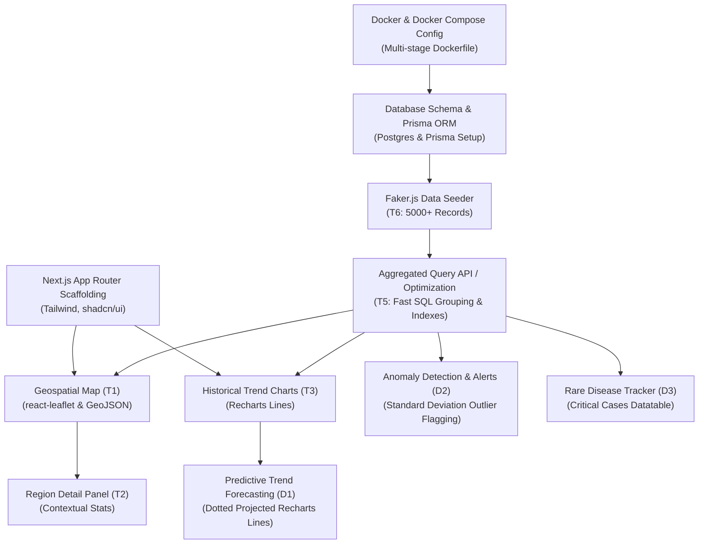

# Features Research: Public Health Radar (Sehat Terus)

This research document defines the functional scope of **Sehat Terus**, a public-facing early warning system and disease surveillance dashboard designed for Indonesian regions. It breaks down features into **Table Stakes**, **Differentiating Features**, and **Anti-Features** (deliberately out-of-scope), highlighting their implementation complexity, dependency mapping, and technical feasibility under the defined tech stack (Next.js, Tailwind, Postgres, Prisma, react-leaflet, Recharts, and Docker).

---

## 1. Executive Summary

Public health surveillance dashboards typically fall into two categories: **descriptive retrospective monitors** and **proactive predictive early warning systems**. 
- **Sehat Terus** aims to transition from a passive reporting tool into an active, public-facing radar.
- By utilizing a highly optimized, indexed single-table database schema (`RekamMedis`) containing anonymized clinical records, the application aggregates geographic and time-series data on-the-fly.
- The system is public-facing and **read-only**, meaning administrative overhead (such as user authentication and data entry forms) is offloaded to external transactional systems (TPS), keeping the core architecture lightweight, fast, and optimized for real-time visualization and analytics.

---

## 2. Feature Matrix Overview

| Feature Code | Feature Name | Category | Complexity | Primary Tech Alignment |
| :--- | :--- | :--- | :--- | :--- |
| **T1** | Geospatial Surveillance Map (Choropleth) | Table Stakes | Medium | `react-leaflet`, GeoJSON, Tailwind |
| **T2** | Dynamic Region Detail Panel | Table Stakes | Low | React State, Tailwind, `shadcn/ui` |
| **T3** | Historical Time-Series Trends | Table Stakes | Low | Recharts, Prisma Aggregate Queries |
| **T4** | Dockerized Environment & Compose | Table Stakes | Medium | Docker, Docker Compose, PostgreSQL 15 |
| **T5** | High-Performance Aggregate API | Table Stakes | Medium | Prisma ORM, Postgres Indexing |
| **T6** | Faker-powered Clinical Data Seeder | Table Stakes | Low | Prisma, TypeScript, Faker.js |
| **D1** | Predictive Trend Forecasting | Differentiator | High | Recharts, Linear/Exponential Regression |
| **D2** | Statistical Anomaly Detection & Alerts | Differentiator | High | Next.js Server Components, Standard Deviation / CUSUM |
| **D3** | Rare & Dangerous Disease Tracker | Differentiator | Low-Medium | `shadcn/ui` Datatable, Prisma Filters |
| **D4** | Cross-Disease Correlation Matrix | Differentiator | Medium | Recharts Heatmap/Scatter, Pearson Coefficient |
| **A1** | User Authentication & Session Mgmt | Anti-Feature | N/A | None (Public Dashboard) |
| **A2** | Patient Record CRUD & Clinical Forms | Anti-Feature | N/A | None (External Ingestion) |
| **A3** | Real-Time WebSocket Synchronization | Anti-Feature | N/A | None (HTTP Polling/ISR Preferred) |
| **A4** | Dynamic Weather/Climate API Sync | Anti-Feature | N/A | Static Mock Data / Offline Import |

---

## 3. Feature Breakdown

### 3.1. Table Stakes (Must-Have)

#### T1: Geospatial Surveillance Map (Choropleth Heatmap)
*   **Description**: An interactive map rendering the geographical divisions of a selected Indonesian region (e.g., Yogyakarta or Jakarta sub-districts/`kecamatan`). It displays case densities per district using color ranges (Choropleth). Clicking on a district filters data globally and focuses the **Region Detail Panel**.
*   **Implementation Complexity**: **Medium**. Requires loading local GeoJSON data in client-side Next.js, matching GeoJSON feature properties (e.g., district name) with database fields (`kecamatan_domisili`), and dynamic coloring based on case rates per 10,000 residents.
*   **Tech Stack Alignment**: `react-leaflet` (Leaflet.js) wrapped in a client-side Next.js component to bypass SSR document errors, Tailwind CSS for map container styling.
*   **Dependencies**: `T4 (Dockerized Environment)`, `T6 (Data Seeder)`, GeoJSON assets.

#### T2: Dynamic Region Detail Panel
*   **Description**: A contextual sidebar or slide-over drawer that displays detailed health statistics for the currently selected district (`kecamatan_domisili`). It updates reactively when the user clicks a map region.
*   **Implementation Complexity**: **Low**. Involves state management linking the selected map feature to an aggregation component that displays total cases, top ICD-10 codes, and recent trends.
*   **Tech Stack Alignment**: Tailwind CSS, `shadcn/ui` Cards/ScrollAreas, Lucide Icons.
*   **Dependencies**: `T1 (Geospatial Map)`, `T5 (Aggregate API)`.

#### T3: Historical Time-Series Trends
*   **Description**: A line graph showing the historical volume of specific diseases over time. Users can filter by time ranges (e.g., 30 days, 90 days, 1 year) and search by disease name or ICD-10 code (e.g., "A90" for Dengue Fever).
*   **Implementation Complexity**: **Low to Medium**. Requires grouping raw database records by day/week/month in Prisma and rendering clean charts.
*   **Tech Stack Alignment**: Recharts (`LineChart`, `XAxis`, `YAxis`, `Tooltip`), Prisma ORM.
*   **Dependencies**: `T5 (Aggregate API)`, `T6 (Data Seeder)`.

#### T4: Dockerized Environment & Compose
*   **Description**: A multi-stage `Dockerfile` and a `docker-compose.yml` config orchestration. It spins up a PostgreSQL container (with persistent volumes) and the Next.js server, ensuring the database is accessible via `DATABASE_URL`.
*   **Implementation Complexity**: **Medium**. Requires setting up a multi-stage Docker build to keep Next.js production image size small, setting up proper health checks on the database to avoid Next.js launching before DB migrations finish, and configuring environment variables securely.
*   **Tech Stack Alignment**: Docker, Docker Compose, PostgreSQL 15+.
*   **Dependencies**: None.

#### T5: High-Performance Aggregate API
*   **Description**: Fast backend query services that aggregate the `RekamMedis` table. Must support spatial grouping (group by `kecamatan_domisili`) and temporal grouping (group by `tanggal_kunjungan` truncated to days or weeks).
*   **Implementation Complexity**: **Medium**. Requires optimizing queries on a single large dataset by ensuring Prisma uses index scans on `tanggal_kunjungan` and `kecamatan_domisili`. 
*   **Tech Stack Alignment**: Next.js Route Handlers (API routes), Prisma Client (`groupBy`, `count`), PostgreSQL.
*   **Dependencies**: `T4 (Dockerized Environment)`.

#### T6: Faker-powered Clinical Data Seeder
*   **Description**: A CLI script run inside the Docker container to populate the `RekamMedis` table with at least 5,000 realistic clinical records. It seeds realistic Indonesian patient data (using appropriate local kecamatan names like Depok, Sleman, Gondokusuman, etc.) and valid ICD-10 codes (e.g., `A90` for Dengue Hemorrhagic Fever, `J06.9` for ISPA, `A09` for Gastroenteritis).
*   **Implementation Complexity**: **Low**. Standard TypeScript script importing Faker.js, using batch inserts (`createMany`) to write records in chunks.
*   **Tech Stack Alignment**: TypeScript, Prisma Client, Faker.js.
*   **Dependencies**: `T4 (Dockerized Environment)`.

---

### 3.2. Differentiating Features (Competitive Advantage)

#### D1: Predictive Trend Forecasting
*   **Description**: Projections of future case counts (e.g., next 14 to 30 days) overlaid on the historical time-series graph as a dotted line. This allows public health officers to anticipate seasonal outbreaks.
*   **Implementation Complexity**: **High**. To avoid a heavy Python backend (which violates the Next.js/Docker constraints), forecasting must be computed in Next.js Server Components. A lightweight, mathematical model like Holt-Winters Double Exponential Smoothing or Linear/Polynomial Regression must be implemented directly in TypeScript/JavaScript to generate future values based on past time-series array elements.
*   **Tech Stack Alignment**: Recharts (specifically using `<Line strokeDasharray="5 5" ... />` for projected data), math.js or custom TS forecasting algorithms.
*   **Dependencies**: `T3 (Historical Trends)`, `T5 (Aggregate API)`.

#### D2: Statistical Anomaly Detection & Alerts
*   **Description**: An automated background validation that flags sudden, statistical spikes in specific diseases compared to their baseline averages (e.g., if Dengue cases in a kecamatan increase by more than 2 standard deviations over the 4-week moving average). It generates "Alert Status Cards" on `/peringatan-dini` indicating "Siaga" (Alert) or "Aman" (Safe).
*   **Implementation Complexity**: **High**. Calculating standard deviations or implementing simplified CUSUM (Cumulative Sum) algorithms directly within database aggregations or server-side functions requires clean mathematical handling to prevent false alerts due to noise or low sample sizes in small districts.
*   **Tech Stack Alignment**: Next.js Server Components, Tailwind, Lucide Icons.
*   **Dependencies**: `T5 (Aggregate API)`.

#### D3: Rare & Dangerous Disease Tracker
*   **Description**: A real-time data table on the `/peringatan-dini` page listing single occurrences of rare, critical diseases that require instant notification according to SKDR guidelines (e.g., Cholera, Measles, Avian Influenza, Polio, Diptheria).
*   **Implementation Complexity**: **Low to Medium**. Requires keeping a static JSON lookup list of critical ICD-10 codes and performing a fast query to retrieve any matching records in the last 7–30 days, sorted by latest date.
*   **Tech Stack Alignment**: `shadcn/ui` Datatable (with paging and filtering), Lucide Icons, Prisma.
*   **Dependencies**: `T5 (Aggregate API)`.

#### D4: Cross-Disease Correlation Matrix
*   **Description**: A correlation matrix visualizing the temporal relationship between different disease types (e.g., identifying if spikes in ISPA correlate with dry season dust spikes, or if Diarrhea rates correlate with Dengue spikes due to common weather seasons).
*   **Implementation Complexity**: **Medium**. Calculates the Pearson correlation coefficient between the daily time-series counts of two disease types.
*   **Tech Stack Alignment**: Recharts Scatter Plot or a grid visualization built with Tailwind.
*   **Dependencies**: `T3 (Historical Trends)`, `T5 (Aggregate API)`.

---

## 4. Technical Feasibility & Constraints Assessment

### 4.1. Leaflet.js SSR Compatibility in Next.js
*   **Risk**: Leaflet.js relies directly on the browser's `window` and `document` objects. During Next.js Server-Side Rendering (SSR), calling Leaflet directly causes a `window is not defined` crash.
*   **Feasibility Strategy**: We must use dynamic imports in Next.js with `ssr: false` to load the Leaflet/react-leaflet components exclusively on the client:
    ```typescript
    import dynamic from 'next/dynamic';
    
    const MapContainer = dynamic(
      () => import('react-leaflet').then((mod) => mod.MapContainer),
      { ssr: false }
    );
    ```

### 4.2. Time-Series Aggregation Performance
*   **Risk**: Aggregating raw patient rows on-the-fly for thousands of queries will slow down performance.
*   **Feasibility Strategy**: 
    1.  Ensure the Prisma schema has composite or single-column indexes on `tanggal_kunjungan` and `kecamatan_domisili`.
    2.  Write highly optimized raw SQL queries via `prisma.$queryRaw` for time-series aggregation, leveraging PostgreSQL's `date_trunc` function to bundle records:
        ```sql
        SELECT date_trunc('day', tanggal_kunjungan) as date, COUNT(id) as count 
        FROM "RekamMedis" 
        WHERE kode_icd10 = $1 
        GROUP BY date 
        ORDER BY date ASC;
        ```

### 4.3. Client-Side Forecasting in TypeScript
*   **Risk**: Implementing forecasting in Next.js needs to be mathematically sound but lightweight.
*   **Feasibility Strategy**: For the trend prediction (D1), implement a double exponential smoothing algorithm (Holt-Linear method) in a server utility file. This algorithm requires only historical time-series counts, estimating trend and level variables to project the future $N$ points, avoiding external heavy machine-learning packages.

---

## 5. Feature Dependencies & Implementation Roadmap

The following Mermaid diagram outlines the critical dependencies between the features. Core infrastructure must be developed first before charts and maps can consume data.



### Implementation Sequence

1.  **Phase 1: Environment & Schema (The Bedrock)**: Build the `docker-compose.yml` to orchestrate PostgreSQL and the Next.js scaffold. Define the `RekamMedis` model in `schema.prisma` with indexes on `tanggal_kunjungan` and `kecamatan_domisili`.
2.  **Phase 2: Mock Ingestion (The Fuel)**: Develop the `seed.ts` script using Faker.js. Inject a diverse dataset containing realistic dates, kecamatan names matching the target local GeoJSON, and realistic ICD-10 distributions. Run this via a custom script (`npm run db:seed`).
3.  **Phase 3: Core Visualizations (The Surveillance)**: Establish the Next.js App Router structure. Build the aggregated API endpoints. Set up Leaflet for geospatial heatmaps (`/`) and Recharts for trend analysis (`/proyeksi-tren`). Ensure client-side dynamic imports are correctly configured for map elements.
4.  **Phase 4: Warning Systems (The Early Warning)**: Implement the `/peringatan-dini` page. Develop the logic for statistical anomaly detection (identifying case spikes per district) and write the query filters for high-severity diseases. Integrate lightweight forecasting algorithms for Recharts.
